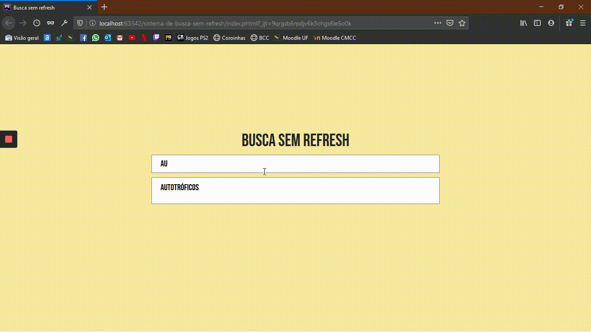

# Sistema de busca sem refresh

Esse sistema é parte de um projeto que estou desenvolvendo na faculdade. É um buscador bem simples, porém útil. :)

## Tecnologias utilizadas
PHP o para backend;
 
JS para o frontend;
 
Boostrap para estilização (Um pouco);

